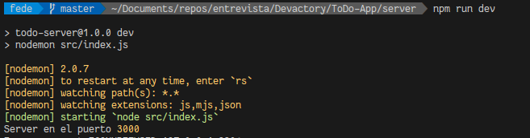

# To Do API 📋


Esta API Rest esta creada para devolver notas en formato JSON desde una base de datos MySQL.

Para su desarrollo se utilizó NodeJS, ExpressJS.

La app se encuentra hosteada en Heroku.


## Urls

[Url de la API](https://sv-todo-app.herokuapp.com/)

[Repositorio de la App que utiliza la API](https://todoapp-di8ecnuof-federico-benitez.vercel.app/#/)


## Pasos para probar en Local
Para probar la aplicación de manera local, debe continuar con los siguentes pasos.
### Pre-requisitos 📋

```
NodeJS
```
### Clonar repositorio 
Primero debemos correr el siguiente comando en la carpeta donde queremos tener el repositorio

```
git clone https://github.com/Federico-Benitez/Todo-App-server.git
```

Despues de que termine de descargarse el repositorio, ya podemos abrirlo con nuestro editor de codigo.

### Instalar las dependencias 🔧
Luego de instalar todas las dependencias, ubicados en la carpeta del proyecto, corremos el siguiente comando.
```bash
npm install
```

### Inicializamos en modo desarollo

Al ejecutar el siguiente comando, la aplicación va a comenzar a hacer una build para desarrollo.
```bash
npm run dev
```


Al finalizar la compilación, podemos acceder a la app desde el navegador a la siguiente url:

[localhost:3000](https://localhost:3000/)


